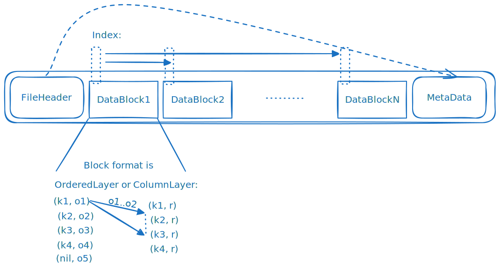
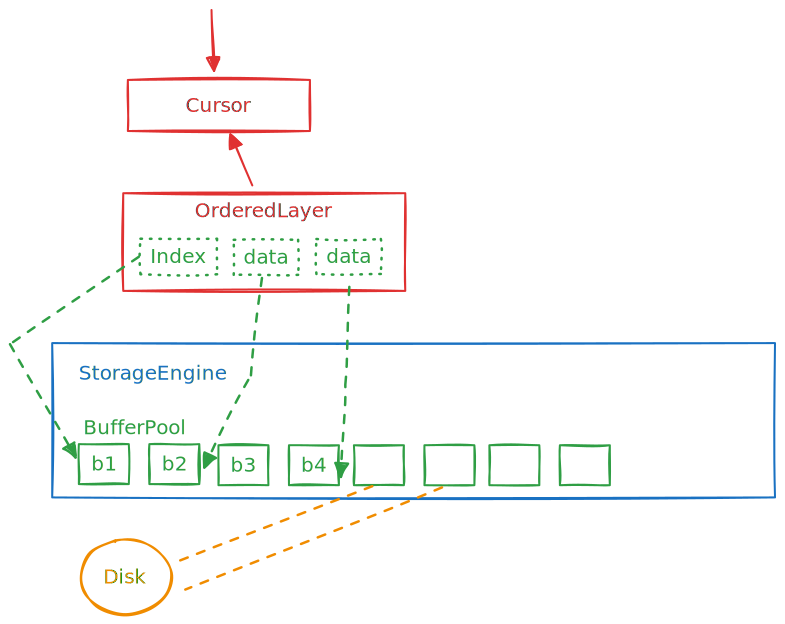

# DBSP Storage Design

This document describes the persistent storage implementation for the dbsp runtime.

## Background

At the lowest level of DBSP, state is stored in two data-structures which both represent (ordered) sets of keys and for
every key, potentially a set of values (OrderedLayer) or a weight (ColumnLayer):

* ColumnLayer: The column-layer holds a key with a weight. The in-memory implementation implements uses two equal-length
  vectors for keys and weights.
* OrderedLayer: The ordered-layer holds key and a set of values per key. The in-memory representation uses a vector for
  keys, a vector for offsets (start/end of values for each key in values), and values -- which is again either an
  OrderedLayer or a ColumnLayer.

These two low-level constructs are then used to build the "middle-layer" data-structures which store state:

* OrdIndexZSet (OrderedLayer<K, ColumnLayer<V, R>, O>)
* OrdKeyBatch (OrderedLayer<K, ColumnLayer<T, R>, O>)
* OrdValBatch (OrderedLayer<K, OrderedLayer<V, ColumnLayer<T, R>, O>, O>)
* OrdZSet (ColumnLayer<K, R>)

These four data-structures are also called batches, because they implement the Batch trait in dbsp. Implementing Batch
gives dbsp a way to combine two data-structures of the same type by merging them together (hence forming a new
"batch"), but also to query the data inside the batch by providing a cursor based API. Another important property
for batches is that they are immutable, they never change once they are created (minus some instances where we 
don't adhere to this design philosophy, more on that below).

Finally, the "upper-level" is just one data-structure called a Spine. The Spine is an LSM tree implementation: It
accepts batches as inputs and maintains a consistent view for the key, values and weights (also by providing a
cursor API -- which now internally uses many batch cursors) across all batches currently in the Spine
(e.g., if multiple batches contain the same key, it will display the most up-to-date value/weight for the given key).
The spine also garbage collects state by periodically merging batches.

## Goals & Motivation

1. Currently, all the above data-structures are in-memory, hence state in dbsp can not exceed the main-memory capacity
   of a machine (assuming no distribution). The goal of this project is to implement a persistent storage layer for
   the above data-structures, which allows dbsp to use a disk as a backing store for state. This will allow dbsp to
   store and query state beyond main-memory capacity.

2. The second goal of the proposal is to be able to store data in the persistent storage layer in a consistent
   manner to survive application crashes and power failures and be able to recover the data structures from disk
   from an earlier checkpoint. In the context of fault-tolerant dbsp this means: if a dbsp worker crashes, or a
   machine becomes temporarily unavailable, instead of having to replay *all* input data from kafka before we can
   resume processing, we can load most of the state from disk and resume processing from the last available
   checkpoint. In addition, data corruption of the persistent state should be detected and result in a graceful
   abort of the worker. Similarly failing to write to the disk should result in a retry (and later a graceful abort).

3. The third goal is to provide both goal 1 and 2 at a performance that is "as close as possible" to the in-memory
   implementation of dbsp. One of the learnings from our rocksdb prototype is that the dbsp performance is very
   sensitive to the underlying storage layer (unsurprisingly).
   For example, we found that the rocksdb implementation of the spine is very slow because of deserialization
   overheads for keys and values. The design we plan in this document addresses this by avoiding any unnecessary
   deserialization (and copy) overheads when loading data from disk altogether. This should allow us to achieve
   performance that is very close to the in-memory implementation as long as we have enough memory available (and
   afterwards we're ideally bottlenecked by the disks latency/throughput+performance of prefetching logic).

### Non-goals

Some things are not part of this proposal, but we try to keep them in mind as they are future work:

- Distributed storage: This proposal only deals state on a single machine. Workers running on multiple machines will
  have their own (local) storage but won't be able to e.g., share state in a unified data-lake or store it such
  that in case of failures we can resume from a new machine.
- DDL Changes: DBSP will support arbitrary schema changes in the future (which changes the format and state of the
  stored data-structures). How to handle schema changes in the persistent storage layer is future work.
- The proposal does not deal with adding/removing or using multiple disks for storage. Although this could be added in
  the future or solved by having a RAID layer.

## How to go about it?

There are three reasonable ways to inject persistence in dbsp:

1. Top-down: Replace Spine (and everything underneath) with a "persistent spine" (e.g., by using rocksdb or an 
   equivalent solution). This means that the spine receives (in-memory) batches (e.g., OrdValBatch) from dbsp and is 
   responsible to store them. As discussed earlier the spine is essentially a KV-store (structured as an LSM tree). 
   So the spine would be  responsible to store the batches on a disk and  merge batches etc. The reader will note 
   that this closely resembles what existing LSM-based KV-stores (e.g., rocksdb) already do.
2. Bottom-up: The OrderedLayer and ColumLayer are replaced with persistent equivalents that no longer hold the entire
   vectors in memory (but only parts currently/recently used).
3. Have a single data-lake that is mostly decoupled from the (in-memory) dbsp. During pre-processing operators prefetch
   all necessary keys from the data-lake which then gets manifested as a set of batches in dbsp. This is similar to
   the top-down approach, but the data-lake is not part of dbsp and dbsp only interacts with it through a well-defined
   interface.

The top-down approach is easier to implement as a lot of concerns can be "just" offloaded to rocksdb, and in fact we
already implemented enough of it. However, we found that it results in a very slow dbsp. The learnings inspired the
bottom-up approach which is what this document will focus on. The third approach is mostly a theoretical idea at 
this point, but for an implementation it is likely more useful as an optimization of the 2nd approach in the 
future as some operators will require to scan all existing state.

## Design

We describe the design for the persistence layer in a bottom-up fashion, focusing on the lowest layers and APIs first.

### Data Format

We need to be able to store ColumnLayers and OrderedLayers on disk, so we need a data-format to represent them. Each
layer can just store data in a file, which means an OrderedLayer will use at least two files: one for keys and
offsets and one (or more) for the value layer(s). Instead of two separate vectors (byte arrays on files) to store the
weights (ColumnLayer) or offsets (OrderdLayer) we will just store the (k,r) and (k1,o1) pairs together as a single
vector (this simplifies lookup and reduces the amount of IO).

The file itself is organized in a header, a metadata section and `n` data sections (holding either OrderedLayer or
ColumnLayer data):



#### FileHeader

Contains a magic number, version and checksum for the file as well as the offset of the metadata block.

#### Metadata

Contains metadata about the file, e.g., the type of data stored in the file, the number of blocks, if compression is
enabled etc.

#### DataBlocks

DataBlocks contain a sub-slice of the corresponding OrderedLayer or ColumnLayer data. We serialize our in-memory
data using [rkyv](https://rkyv.org/) and store the serialized data in the file. The point of using rkyv is that
it will allow us to read/write data from/to disk without any deserialization overheads. The way this works is that
for every type T, a matching type T::Archived is generated by the library which represents T in a serialized form.
Most of the raw types like strings, u64, etc. can be directly accessed in the Archived form. For more complex types
like vectors, we can use the ArchivedVec type which is a wrapper around Archived<T> and provides a slice-like API.

One open question is how if data-blocks should be variable or fixed size (e.g., 4MB). Variable size might be easier to
make it work with rkyv (since it's not clear yet how to efficiently determine the number of bytes for a given key
range with rkyv). However, fixed size might be easier for the buffer manager.

We should write a checksum for every data-block to detect data corruption and compress blocks as an option.

##### Indexing

We need to be able to find the DataBlock for a given key in an efficient way (touching a small amount of blocks on
disk). Another way we need to access our data is through indexing by order (usize) for the OrderedLayer value access.
This means the index should also include the order of the first and last element in the block.

The typical solution for this is to have a B-tree (or skip-list etc.) index pages in the file. For smaller files, an
easier solution is to just store a sorted list of blocks and their first and last key for every block in the
MetaData block.

We also need a bloom filter for every file to quickly determine if a key is not part of the file.

There are existing rust libraries for simple bloom filter algorithms that also are serializable to disk.
For the storage format, we can use rkyv to do serialization/deserialization for us, but given that we use rkyv itself
there is no good storage format that already works with rkyv. So we need to define our own disk format for it.

An alternative may be to use an existing file format (e.g., parquet). There are two obstacles: the parquet libraries
define the data-schema at runtime, whereas dbsp uses generics to define the data-schema at compile time. This means
we would need to generate the parquet schema at compile time and then use the generated schema to read/write data.
This is possible but requires some compiler work.

Another obstacle is that parquet will still have to perform data deserialization on reads and has limited support for
custom types (whereas in dbsp our values and keys can be 'arbitrary' rust types).

### Storage Engine / IO Access

We need a storage engine that handles IO for us. The storage engine abstracts away the details of the file read/write
API.

We will aim to support two backends:

- [`io-uring`](https://kernel.dk/io_uring.pdf): This interface is the most efficient and allows us to get data from
  disk into a user-space buffer using a 0-copy approach (e.g., disk DMAs directly into the user-space buffer).
- POSIX `read` & `write` (using direct IO, and potentially vectored): Allows dbsp to work on non-Linux hosts when
  performance doesn't matter and developer does not want to use io-uring.

In the future, we can potentially support spdk too. This will increase CPU efficiency by 2x and can increase
performance (by 10-20%) over io-uring according to [1]. The downside is that it requires exclusive access over the nvme 
drive(s) & a FUSE file-system needs to be mounted for inspection of storage files etc. So it's a tradeoff between max.
performance for usability if we would want to significantly improve resource util. However, maybe io-uring will
catch up wrg. to efficiency too (as it's still pretty new).

There are existing rust APIs/libraries we can use for both backends. What we need to do is wrap this under a common
interface to abstract the details away from clients.

#### io-uring

io-uring has multiple modes:

- iou: interrupt from device, syscall for submit receive queue
- iou+p: poll device, syscall for submit and receive queue
- iou+k: poll device, poll submit and receive queue (`IORING_SETUP_SQPOLL`)

Here are some (performance) observations about io-uring from [1]:

- iou+k has the best performance (similar to spdk) but requires 2x the amount of
  cores for the same performance as spdk (because one extra poller kernel
  thread).
- Sharing kernel poller threads among several thread is something that is
  supported by io-uring (not investigated in paper).
- iou vs. iou+p has little throughput difference but overall less performance
  for lower core counts (40% slower than iou+k or spdk).
- iou+p approach has better latency than iou.

This conflicts somewhat with findings in [2]:

- We run experiments with io_uring using SQPOLL (iou+k) as dedicated I/O threads, but this actually decreased
  performance and efficiency. This is the case because kernel workers take up CPU cores that could otherwise be used
  by worker threads. Further adjusting the number of I/O threads is difficult and highly dependent on the workload.

It seems the simplest way for now is by using the `iou+k` model and a reserve some cores for kernel IO (polling) and
leave the rest for dbsp threads. Note that polling here doesn't mean 100% CPU utilization as it would with dpdk or
spdk (as the kernel threads will still have configurable back-off timeouts).

#### API

At the lowest level, the storage backend should be a (potentially async) API that allows a client to
submit reads and writes to/from files and give indication to prefetch certain blocks. e.g., on a very
abstract level it supports the following operations:

```text
type FilePtr = (file_descriptor, offset, length) // or just (fd, block_number)
read(FilePtr) -> Arc<FileBlock>
prefetch([FilePtr; N])
GetFreeBuffer() -> Arc<Buffer>
write(FilePtr, Buffer)
```

#### Buffer pool

Internally, the Storage Engine will need a buffer pool to cache previously read (or written) data for reuse by clients.
A policy (e.g., LRU) can be implemented to evict buffers from the pool once memory becomes scarce.

The exact details for this are TBD, but there are some important points to consider for the design:

- Most likely the buffer pool for allocating buffers will need to be shared among all threads or allow some way to
  rebalance buffers in case one dbsp worker thread runs out of memory and another has spare buffers.
  This can be implemented using a layered approach for buffer management (e.g., have a fast thread-local buffer pool and
  a slower shared buffer pool).

- In dbsp a buffer is accessed only by a single thread (since the data in Spines are per dbsp-thread and partitioned).
  Though, this might change in the future once we no longer store the entire row as values in dbsp.
  So we might still want to use Atomic reference counts on the buffers.

- For good performance with io-uring, the buffers need to be registered with the OS before use.

- Ideally the buffers should all be a fixed size (e.g., 64 KiB or 2MiB) so the buffer pool allocator can be implemented
  in
  a simple fashion (e.g., a slab). (It's not clear to me this is possible with rkyv out of the box yet.)

There are a few ways to implement this:

- Use existing libraries that implement buffer pools:
  I didn't find anything in the rust library ecosystem we can "just use" for this yet instead of writing our own,
  but there are definitely some building blocks (e.g., slab allocator)
- Another alternative is to just rely on the malloc implementation and call the eviction policy if malloc fails.
  This probably isn't ideal as we don't expect malloc to fail in other parts of the code and changing the rest
  of the code to handle malloc failures is more work than using a separate buffer pool.



### Persistent Ordered and ColumnLayers

The next step is to implement the persistent version of the OrderedLayer and ColumnLayer. While the logic of these
can closely resemble the in-memory versions, the important difference is that we can no longer store the entire
data-set memory. Instead, we need to store the data on disk and only load parts of it into memory when needed. This
can be done by interacting with the storage engine described above.

The persistent versions of the layers will need to implement the following APIs to match the DRAM functionality:

```text
keys() -> usize
cursor(from, to) -> Cursor
sample_keys()
retain() // this is new I don't understand yet what it does
truncate(bound: usize) // ignore everything above `bound`
truncate_below(bound: usize) // ignore everything below `bound` in the future
```

Certain APIs we currently have in dbsp will not work with a fully immutable/on-disk layer.

- We currently store the lower_bound in a ColumnLayer, but this is not possible in a persistent layer. So we would
  refactor this to be part of the Spine meta-data in the future as it is the same for all layers in the spine.
- There are APIs like `keys_mut`, `diffs_mut` etc. that return a mutable reference to all the keys. This is not
  possible in a persistent layer.
- Other APIs make assumptions that all keys and diffs are available in DRAM e.g., `columns_mut`, `as_parts`,
  `into_parts` etc. These APIs will need to be refactored to work with the persistent layer either by eliminating
  them or by providing an iterator instead of the full slice.
- Some of these function seemingly are only used by the JIT, so we can probably remove them easily.

Then there are some traits that we need to implement like MergeBuilder and TupleBuilder to construct new layers and the
Cursor trait to iterate over a layer. There are a lot of methods on Cursors, but from an implementation perspective 
the part that's really different is the implementation for seek (which now needs to take into consideration the 
index to minimize disk access). While there might be some re-use of the existing code, the persistent versions will 
need to work with a limited amount of data-blocks in memory at any time which is something the current code doesn't
consider.

### The Ord family (OrdIndexZSet, OrdKeyBatch, OrdValBatch, OrdZSet)

This will be the part that we get almost for free if we have the persistent layers because we can probably "just" use
the DRAM implementation. However, here as well we will encounter are a few things that won't fit with persistence (like
the `valid` flag or the `recede_to` functionality but in discussion with Leonid `recede_to` can probably be
eliminated completely).

### Persistent Spine

Finally, the Spine needs to be implemented for persistence. The spine keeps a collection of batches, and uses cursors
into them to lookup keys and values and computes the right weight during reads. It also merges batches to garbage
collect and maintain state. Again, at least initially we should be able to keep most of the DRAM code for the Spine
implementation. However, we need to ensure that the spine state is persistent itself. This involves storing which
batches (files) are currently in the spine along with certain meta-data (bounds and filters mentioned earlier).
While it's not a lot of state, it's important to store this data in manner that is consistent with the persistent layers
so a spine's original state can be recovered from disk in case of failures. This will require either some minimal
form of transactions or at least carefully chosen fsync calls for batch data and spine (e.g., we can't just write the
spine state to disk and then the batches after or vice-versa).
We also might keep a single write-ahead log for all spine state or have a separate file/log for every spine which logs
changes such that they can be check-pointed.

### Integration with the rest of DBSP

While the previous sections focused on the storage layer functionality, in order to have a complete system
we need a control plane API. This includes: 

#### Data Consistency, Checkpoints & Distribution

The requirements for consistency in presence of multiple workers are 
[slightly different than for a single worker](https://github.com/feldera/dist-design/blob/main/rocksdb.md#coordinated-commit). 
In essence: a worker needs to be able to participate in a distributed commit protocol to ensure that all workers 
have the same view of the data. If one of the workers abort, all clients need to revert to the previous checkpoint.

The easiest way to support this is likely with a global undo-log for all spines on a worker. The log stores all layers 
that got introduced to spines and all merges. An undo-log will remove layers from spines and revert merges (by 
keeping the previous data files around until the checkpoint is no longer reachable).

One of the control plane APIs will be a transaction API which commits modification of all DBSP Spine and Layer state
to disk. Another API will be added to restore to a previous checkpoint.

#### Getting more parallelism for the disks

nvme disks need a lot of parallel requests for full performance. This means we need to be able to issue
many IO requests at once. There are several ways to achieve this in dbsp:

- Prefetch based on incoming data batches: We have batches coming in (small) and they usually require seeks 
  in bigger persistent Spines. We can use the keys of the incoming batch to start prefetching the stored state.

- Prefetch based on cursor usage. These are pretty basic optimizations, but we can prefetch the next block if we know
  a cursor is doing a sequential scan.

- Add many more shards (micro shards)
    - This will partition the data across many more Spines and hence generate more parallel requests
    - However, it will have more overhead as all shards are currently a (POSIX) thread so it likely won't be great if we
      have 1000s of shards
    - It may also make the problem of imbalance among batches worse

The prefetching API will be part of the storage engine API, but still we need to inject the prefetching logic in the 
right places of dbsp. This is likely hard to get right so we need to be able to gather performance metrics about it too
in the future.

#### Making the Spine smarter

The spine currently uses fairly deterministic and simple heuristics to decide when to merge batches. In addition, 
the merging happens in the foreground (with some ways to continue serving reads even with partially merged batches).
For a persistent Spine implementation, it is likely better to merge batches in the background and swap them once 
the merge is complete.

#### Passing the serialized data format all the way to the operators

It may not have become obvious but in the current design, we will be using the rkyv serialized data format all the way
to the cursor. However, after the cursors is where the data is actually used by the operators. At this point the current
dbsp APIs will require us to deserialize the data and pass it on to the operators. This isn't ideal as in many cases
it's not necessary and the dbsp operator (e.g., doing equality checks or simple arithmetic) can be implemented on the
serialized data directly. This will require some refactoring of the dbsp operator APIs to allow them to work on
serialized types and actual types interchangeably. We discussed some solutions for this, but it is future work for now.

#### DBSP (and corresponding File Format) updates

Ideally the file format should be relatively stable, but we will likely make changes in the future anyways as we 
work on dbsp. This means we need to be able to read old files and convert them to new formats. This can be done by 
adding a version number to the file header and then having a conversion function that converts the old format to the 
new format stored as part of the dbsp library code. The code can then convert files either lazily (e.g., during 
merges) or in an eager fashion on program startup. This also means that the program logic associated with a given  
file-format version (e.g., ColumnLayer implementation) is preserved (in case of lazy updates) since we need to ensure 
that the layer can always handle all formats it might encounter.

Furthermore, the approach described in this document uses rkyv to define the storage layout with compile-time types, 
which means that the type we persisted (e.g., key or values) will also likely have to be versioned in order to detect 
changes in them. This will require some support from the compiler which ultimately generates these types 
persisted. At the very least we should have static asserts/tests to validate that the format of a type has not 
changed accidentally between feldera releases.

#### Pipeline Updates (DDL Changes)

Future implementations of SQL will support DDL changes (e.g., adding/removing columns). Changes in schema will likely
lead to changes in the underlying persisted layers. This means we need to be able to update the file format to 
reflect the new schema. This is future work as it will require help from the compiler to generate a transformation 
plan for the data. However, similar to format changes it can be done lazily or eager (on restart) and will
require a version/identifier to detect what changes have been applied to which files. The lazy approach is likely to
be complicated as we need to save the transformation plan and keep it until all data has been transformed.

### Testing

Testing the implementation of this design needs to consider three aspects:

- Functional correctness: This can be ensured with unit and model-based tests that validate the correctness
  of the persistent implementations against their DRAM counter-parts (e.g., the ColumnLayer client API
  should behave the same as the one for PersistentColumnLayer).
  Finally, two versions of pipelines (DRAM and persistent) can be run with the same inputs and
  their outputs should be equal.
- Correctness in presence of software crashes: This can be ensured with a test-framework that runs the pipeline
  and injects faults at random and well-defined/critical code-points. The system is evaluated
  for successful resume and maintaining data integrity.
- Correctness in presence of hardware/OS failures: This can be tested using fault injection libraries
  and building testing infrastructure that physically cuts power. The system is evaluated
  for successful detection of data-corruption+abort and/or maintaining data integrity.

### Tooling

We will need a CLI tool to inspect, validate and potentially transform the on-disk data files.
This needs some help from the compiler which should generate the data-schema for state in every persistent spine,
so we can store it together with the data. (Otherwise, the CLI tool will not know how to interpret the
data on disk.). In fact, if the types are very complicated, the compiler might have to generate the CLI tool (or at 
least the types used in the files as part of a library) we won't be able to interpret it otherwise.

An alternative approach might be to just be able to open a pipeline in static/snapshot mode where it allows us to
read/inspect all data through an HTTP API. This would likely be easier to implement.

## Related Systems (or why don't we just use X)

Roughly existing systems/storage engines can be categorized into two designs:

Embedded stores (linked together with the application, using rust API to interface):

- [RocksDB](https://rocksdb.org/): Since we don't have control over data-alignment from RocksDB we can't make use of
  zero-copy reads. This is problematic for performance as we found out in our prototype.
- [LMDB](https://github.com/vhbit/lmdb-rs): This stopped making progress in a simple benchmark after storing ~60M keys.
- [SplinterDB](https://github.com/vmware/splinterdb): No rust bindings, still experimental.
- [Sled](https://github.com/spacejam/sled): Slower than rocksdb in simple experiments, not mature yet.
- [sqlite](https://www.sqlite.org): Not a KV-store, but can be used as one. Not sure how it performs.

Distributed storage systems:

- [Apache Paimon](https://paimon.apache.org/): A distributed LSM tree. This is what Flink wants to use as a future
  distributed storage layer, still early/experimental & in Java (though we might be able to use GraalVM to have 
  efficient boundary crossing between [Rust+Java](https://www.graalvm.org/jdk17/reference-manual/llvm/Compiling/#running-rust)).
- [DAOS](https://docs.daos.io/v2.4/overview/architecture/): A HPC key-value store based on spdk. This is somewhat
  interesting, as it claims arbitrary alignments and zero-copy IO. Haven't tried it yet.
- [FoundationDB](https://www.foundationdb.org/): A distributed key-value store. Complicated setup. Most likely not
  faster than rocksdb for a single node.
- [RockSet](https://rockset.com): Distributed RocksDB, will suffer from the same problems as single-instance RocksDB.
- [DragonflyDB](https://www.dragonflydb.io/blog/scaling-performance-redis-vs-dragonfly): A Redis clone that is much
  faster. The linked blog shows >3M get/set operations per second. Under BSL so we won't be able to use it.

## References

[1] Understanding Modern Storage APIs: A systematic study of libaio, SPDK, and
io_uring ([PDF](https://atlarge-research.com/pdfs/2022-systor-apis.pdf), [Talk](https://www.youtube.com/watch?v=5jKKVdJJqKY))

[2] What Modern NVMe Storage Can Do, And How To Exploit It: High-Performance
I/O for High-Performance Storage Engines ([PDF](https://www.vldb.org/pvldb/vol16/p2090-haas.pdf))

[3] TRIAD: Creating Synergies Between Memory, Disk and Log ([PDF](https://www.usenix.org/system/files/conference/atc17/atc17-balmau.pdf))
